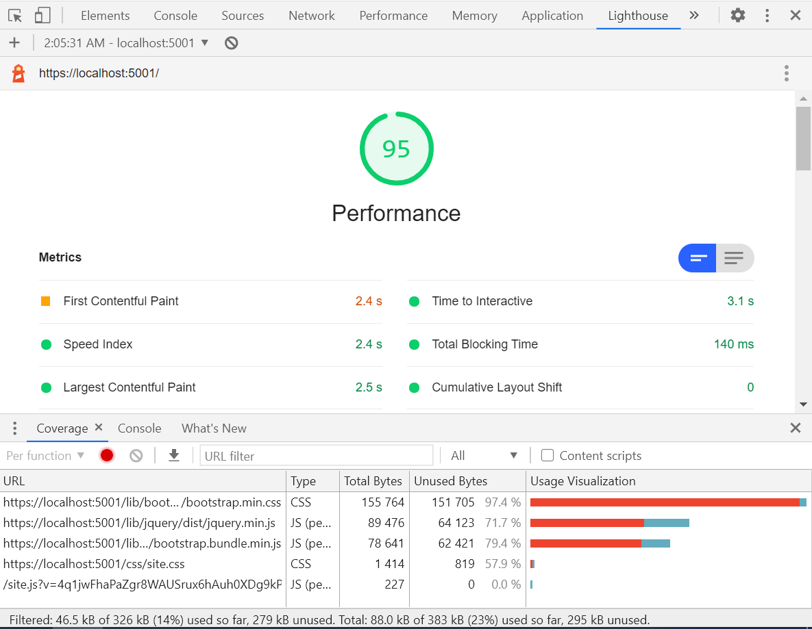

# vendor-coverage-workflow

TL;DR: went from a page load of 2400ms down to 1700ms in lighthouse's rating of a demo project by running a script on 3rd party CSS and JS. A score of 95 to a 99. The CSS is realtively common, but I *believe* the JavaScript isn't really being done out in the wild. 


note that this LH run which scored 100 with a 0.8s FCP was a super lucky fluke that I'm too proud of to actually delete and re-take.  I'm sure the real numbers are closer to the 1.7s I'm talking about.

## About this project

Google lighthouse is a tool available within the chrome browser which gives a report on various web-page quality metrics. A higher value in these scores can directly translate into project profitablity.

One major issue I was running into with my projects was getting points deducted for any files that have more that 20kb of unused code.

Vendor libraries like bootstrap and jquery offer a tremendous leg-up during early development, but when it comes time to deliver the final code your lighthouse scores can suffer. 

Alternatively, some legacy projects may find that making the argument to refactoring from the ground up in order to save 500 miliseconds on a page load doesn't go over well with the business types. (Shocking, I know) 

As an exercise in "can this even be done?" I thought I'd take a kick at the can. Can we design a relatively painless plug-in for existing and low-budget architectures which allows teams to leverage the power of vendor frameworks while squeezing out those sub-second performance gains? 

## On usage rights 

I imagine this technique is easily transferrable to other languages and frameworks, but for the purposes of the sample I'll be working on a default `dotnet new mvc`.

There is no proprietary code in this and I'm writing on the weekend so I can share these results with you. Under the MIT license, you can take this to your fortune 500 day job and plug it in without fear. 

I'm hoping that through community feedback and further insights we can get this to a point where we can be confident in its robustness and start using it in production.

On with the show...

## Enter "COVERAGE"

If you look in chrome developer tools under the "three dots" menu you can see a COVERAGE tab. Look at the bottom-half of this image and we'll discuss what it means below.



See those large RED bars? That's a visualization of the unused portion of the CSS and JavaScript. In theory I can save `97.4%` of my bootstrap load and realize massive gains. 

Perhaps by automating the extraction of CSS into a new file we can get better. In looking around the internet, there are a number of posts on how to do this once, but it isn't yet compiled into a pluggable system.

### The pseudo logic

1. write your website
1. launch it locally
1. run a coverage report
1. discard all the "red bits"
1. save the subset and serve it as a static file

### The interesting parts of the CSS code 

#### ensure you can serve "full fat" files on demand

In order to make sure we can generate complete and robust trimmed files, we have to be able to pull the full version of the site on demand.

In order to accomplish this we make sure our controllers inherit from a shared base controller that has built in query string detection for the unoptimazed site.

```
    public abstract class BaseMyWebsiteController : Controller
    {
        public override void OnActionExecuting(ActionExecutingContext context)
        {
            base.OnActionExecuting(context);
            Request.Query.TryGetValue("generatecoverage", out StringValues fullcss);
            ViewBag.GenerateCoverage = fullcss.Count > 0 && fullcss[0].ToLower() == "true";
        }
    }
```

in our `_Layout.cshtml` we go on to add a control statement.

```
    @if(ViewBag.GenerateCoverage){
        <link rel="stylesheet" href="~/lib/bootstrap/dist/css/bootstrap.min.css" />
    } else {
        <link rel="stylesheet" href="~/coverage/css/bootstrap.min.css" asp-append-version="true" />
    }
```

Next, we need to launch our site run coverage analysis in a headless web browser `puppeteer` and compile the trimmed-down version of the CSS into a static file.

Turns out that is relatively easy and safe.

To get a sense of how that works check out the `extract_coverage` funtion in this [gulpfile.js](gulpfile.js)

In pseudo code we:

1. launch the site locally using a gulp dotnet wrapper.
1. pull the coverage in `puppeteer`
2. process the coverage report

Super easy! Yay!  How did we do? See below!


We boosted our performance from a 95 to a 98! We got the bootstrap CSS down to 4.6Kb! a savings of around 145Kb per page load and our team can still use bootstrap.

In **theory** as they add bootstrap classes through the project's lifecycle, these will be detected and added dynamically by this vendor coverage system.

Kinda feels like a win doesn't it?  

Unfortunately, like the parent who says "what happened to the other 5%?" when their kid comes home with a 95% on their school paper, I could only see that JavaScript.

Unacceptable! Can we do better?

### The interesting parts of the JS code 

Turns out JavaScript is a *LOT* harder to work with. You can't just rip out the unused parts without introducing syntax errors.

... or can you?! ...

Well it turns out if you have two thumbs and are an idiot you won't let something like terrible decisions stop you from racking up lighthouse points.

#### the JS psuedo code

1. load your javascript coverage report
1. build the inverse report in order to get a definitive list of code blocks that are not used.
1. try to remove the block
1. if the updated code compiles use the new code as your baseline
1. repeat until you've trimmed all you can

In my work, I discovered that the easiest win here is to replace every unused function with an empty one.

You can see this in action within the `strip_coverage_js` in the [gulpfile.js](gulpfile.js)

```
// get the text you're going to remove
try_removing = entry.text.slice(range.start - 1, range.end + 1);
// regex match to detect it as a function
if(/^function\(.+\}$/.test(try_removing)){
    // replace it with a stub
    this_attempt_js = last_good_js.replace(try_removing, "function(){}"); 
}
```

Now it's not enough to just swap out the code, you also have to run a sandboxed javascript environment to evaluate the code after each edit.  Producing broken javascript doesn't do anyone any good at all!

For that we use the `js-interpreter` library and wrap the evaluation in a try catch. If we don't throw an exception we keep going! (When has something like that **ever** gone wrong? This plan is flawless!)

Anyways, how did we do?


We racked up another 1% performance and shaved roughly another 100Kb!

We reduced our page load time from 2.1s down to 1.7s! Down from 2.4s when using both techniques combined.

Kinda cool right? 

It's at the point where I think it's ready to share.

## Future development and outstanding challenges

### Challenge: make this run as a watch task

The orignial goal was to make this something that runs in a "WATCH" task. By monitoring developer files and automatically re-building the CSS and JS as functions are added could we catch the unintended consequences while building our sites?

There are some challenges around getting the signal that the site has resatarted out of `DotnetWatch` and back into gulp so we can execute our extractions.  The first round of challenges would have been insurmountable if I hadn't gone into the abandoned npm module and fixed a few bugs that arose in dotnetcore 3.1+

Be warned that version of dotnetwatch on NPM does not have the edits required to make this work. [dependencies/gulp-dotnet-watch-customized](dependencies/gulp-dotnet-watch-customized)

There are some things I don't know about how gulp works. How do I bubble an event from within dotnetwatch such that I can have the extractions run once the views have finished recompiling? I feel like I'm really close on that one, but there's one little thing missing. Maybe a `.bind` on the function I pass to the watcher or something like that.

Another Quality of Life improvement I'd want to take care of in a production setting is that I'd prefer it if every execution of the extractor didn't spawn a new browser window. I know that is as simple as creating a launch.json file and passing in the parameter, but after a long stretch on the hard stuff, I didn't have the energy keep going on that path. It's proabbly "super easy" though I swear!

Can we further reduce javascript? Some thoughts for techniques to try:

### method for investigation #1: use a shared stub function.

instead of replacing each function with 12 characters usign the string `function(){}` could we instead insert a single named stub?

Consider the resulting javascript code:

```
toArray:function(){},
get:function(){},
pushStack:function(){},
each:function(e){return S.each(this,e)},map:function(){},
slice:function(){},
first:function(){},
last:function(){},
even:function(){},
odd:function(){},
eq:function(){},
end:function(){},
```

is functionally identical to:

```
function x(){};
/* [...] */
toArray:x,
get:x,
pushStack:x,
each:function(e){return S.each(this,e)},
map:x,
slice:x,
first:x,
last:x,
even:x,
odd:x,
eq:x,
end:x,
```

We could effectively save 11 more characters per function. I bet that adds up fast.

### method for investigation #2: eliminate unused function names as well

Consider the above code again. In lowest-terms, isn't this ALSO the same thing?

```
each:function(e){return S.each(this,e)},
```

How can we get to that point? Through the power of regular expressions!

Something for further hacking might be to write build the regex that can detect the name of the function before the stub up until the comma at the end

My deepest apologies to those of you who don't speak regex. My first job was in programming PERL about 20 years ago so I've got some residual "everything is a regex" in my professional life. 

Off the top of my head the regex to match for `new RegExp("[a-zA-Z0-9_\-]+:"+try_replacing+"{},)"`

According to https://regex101.com it looks like I could replace a huge proportion of my functions with entirely `blank-space`


There are some concerns around the last comma in a long array of functions in this syle, but since we test and retest after every swap, this should actuallly be reasonable "safe".

All that said, I still think this is in a state that counts as "good enough to share" I'd love to hear your constructive thoughts on this.

## Oh! You're still here?! (*cough* check out my podcast!)

If you're looking for ways to get ahold of me, you're welcome to open an issue on this repo for further discussion.  If you're looking to say "hi" or "thanks" or to troll me for being a n00b.

Please feel free to reach out in any of the channels posted on my Podcast's repo.

The goal of the show is to interview developers that I look up to in order to hear about their careers and learn about their thinking. 

Hopefully with the goal of becoming better developers and engineers together.

I would love it if you'd come along to be part of the conversation.

Check out the show at: 

## [LGTM: shipit - github repo](https://github.com/alexchesser/lgtm-shipit)

My contact details are in the readme there.

## [LGTM: shipit - youtube playlist](https://www.youtube.com/playlist?list=PLOQ-MAplLyJpiWQQehkdTdjESbUKZVk4I)

Watch me get better at actual content creation!

## [LGTM: shipit - podcast](https://anchor.fm/lgtm-shipit)

We're on spotify and google podcasts!

Really sorry about the distribution to Apple. I screwed up in test and can't get listed anymore.

I've got a support ticket with Anchor, but if you've ever tried to do anything on the apple store, you know that I'm in for a bumpy ride here.

 
